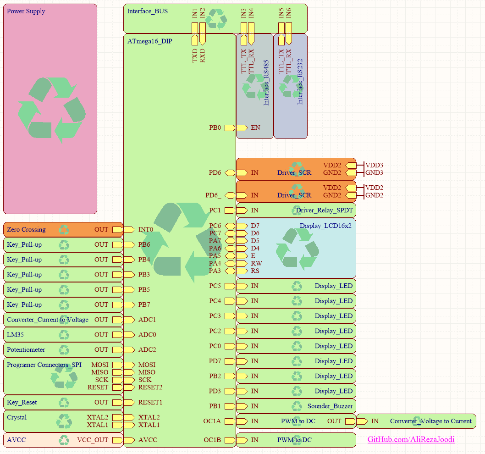

## AVR Training Board Exclusive for Dimmer

MCU:        ATmega32   
Frequency:  11.059200MHz (External) 

Digital Input:
- Zero Crossing Pulse 
- Button (5x)
 
Analog Input:
- 4~20mA
- Temp Sensor LM35
- Potentiometer 

Digital Output:
- SCR Pulse (2x)	  
- LED (8)
- Buzzer
- 16x2 Character LCD
- RS232

Analog Output:
- 4~20mA
- 0~5V

### Folder and Files Description
It has included:
- `Example` (Sample Codes)
- `Hardware` (Included hardware layers)
- `Pictures` (Photos Samples Made)
- `Simulate` (Simulator File)

### Pictures: v1.0

### Schematic: v1.0

### Simulate: v1.0

My GitHub Account: [GitHub.com/AliRezaJoodi](https://github.com/AliRezaJoodi)  
**Note**: [You can go here to download a single folder or file from GitHub.com](https://minhaskamal.github.io/DownGit/#/home)
