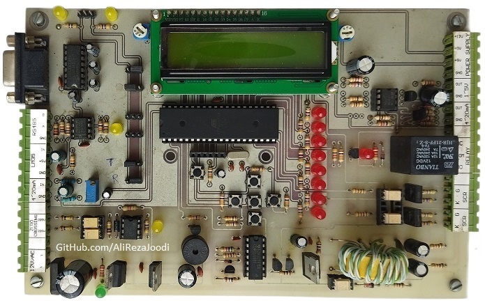
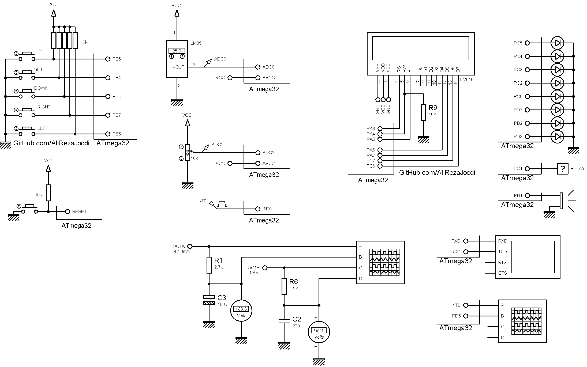

## AVR Training Board Exclusive for Dimmer

MCU:        ATmega32   
Frequency:  10MHz 
Display:    16x2 Character LCD     
Interface:  RS232   

### Folder and Files Description
It has included:
- `Example` (Sample Codes)
- `Hardware` (Included hardware layers)
- `Pictures` (Photos Samples Made)
- `Simulate` (Simulator File)

### Pictures: v1.0

### Schematic: v1.0

### Simulate: v1.0

My GitHub Account: [GitHub.com/AliRezaJoodi](https://github.com/AliRezaJoodi)  
**Note**: [You can go here to download a single folder or file from GitHub.com](https://minhaskamal.github.io/DownGit/#/home)
